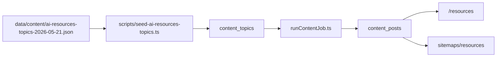

# AI Resources Content Hub — audit (2026-05-21)

**Scope:** Audit only for ScholarshipTop `/resources` content pack (`AI` category + 30 English articles).  
**No generation, no DB writes, no commits** were performed as part of this audit document.

**Production domain:** `https://scholarshiptop.com`

---

## 1. Executive summary

Resource articles are produced by the standalone **Content Hub worker** (`services/content-hub/`), stored in Supabase **`content_posts`**, and surfaced at **`/resources/{slug}`** when `status = published`. Categories on the hub are **not stored in the database**; they come from static taxonomy + per-slug overrides in `data/resource-article-classification.json`.

The planned **AI pack** should use the existing worker (topic queue → OpenAI → insert post), with new **safety guards**, **forced slugs** from a JSON topic pack, **`AI` taxonomy**, and a **read-only dry-run** script before any production writes.

---

## 2. Architecture



### 2.1 Primary generator (use this pack)

| Role | Path |
|------|------|
| Batch worker | [`services/content-hub/src/jobs/runContentJob.ts`](../../services/content-hub/src/jobs/runContentJob.ts) |
| Publish one queued post | [`services/content-hub/src/jobs/publishNextPost.ts`](../../services/content-hub/src/jobs/publishNextPost.ts) |
| OpenAI | [`services/content-hub/src/lib/openai.ts`](../../services/content-hub/src/lib/openai.ts) |
| Prompts | [`services/content-hub/src/lib/prompts.ts`](../../services/content-hub/src/lib/prompts.ts) |
| Validators | [`services/content-hub/src/lib/validators.ts`](../../services/content-hub/src/lib/validators.ts) |
| Supabase client | [`services/content-hub/src/lib/supabase.ts`](../../services/content-hub/src/lib/supabase.ts) |
| Env schema | [`services/content-hub/src/config/env.ts`](../../services/content-hub/src/config/env.ts) |
| Env template | [`services/content-hub/.env.example`](../../services/content-hub/.env.example) |
| PM2 / cron | [`services/content-hub/ecosystem.config.cjs`](../../services/content-hub/ecosystem.config.cjs) |
| Docs | [`services/content-hub/README.md`](../../services/content-hub/README.md) |

### 2.2 Next.js app (read + post-process)

| Role | Path |
|------|------|
| Load posts | [`lib/content-hub/contentPostsServer.ts`](../../lib/content-hub/contentPostsServer.ts) |
| Hub + filters | [`components/content-hub/ResourcesIndexPageContent.tsx`](../../components/content-hub/ResourcesIndexPageContent.tsx) |
| Article page | [`app/resources/[slug]/page.tsx`](../../app/resources/[slug]/page.tsx) |
| Taxonomy | [`lib/content-hub/resourceTaxonomy.ts`](../../lib/content-hub/resourceTaxonomy.ts) |
| Classification overrides | [`data/resource-article-classification.json`](../../data/resource-article-classification.json) |
| Sitemap | [`lib/seo/sitemaps.ts`](../../lib/seo/sitemaps.ts) |
| Article matching API | [`app/api/internal/resources/apply-article-matching/route.ts`](../../app/api/internal/resources/apply-article-matching/route.ts) |

### 2.3 Alternate path (not recommended for this pack)

[`scripts/generate-keyword-seo-pages.ts`](../../scripts/generate-keyword-seo-pages.ts) — line-based topics file, built-in dry-run unless `--publish`. Lacks pack metadata, forced slugs, and AI positioning rules.

---

## 3. Data model

### 3.1 `content_topics`

| Column | Notes |
|--------|--------|
| `topic` | Plain text; worker reads only this field today |
| `status` | `queued` → `processing` → `done` / `failed` |
| `priority` | Lower = picked first |

Seed for AI pack: [`scripts/seed-ai-resources-topics.ts`](../../scripts/seed-ai-resources-topics.ts) encodes pack metadata in `topic` as `AI_PACK|...` (no schema change).

### 3.2 `content_posts` (required on insert)

| Field | Required |
|-------|----------|
| `title`, `slug` (unique), `h1`, `excerpt` | Yes |
| `body_markdown`, `body_html` | Yes |
| `meta_title`, `meta_description`, `primary_keyword` | Yes |
| `topic_id`, `word_count`, `char_count`, `schema_json` | Yes |
| `status` | `draft` / `review_needed` / `published` |
| `published_at` | Set when published |
| **category** | **Not in DB** — use taxonomy + classification JSON |

Public visibility: RLS / queries use `status = 'published'` and non-empty `slug`.

### 3.3 Storage

Cover images: bucket **`content-images`** (essay hero reuse by default, optional FAL).

---

## 4. `/resources` categories

- Defined in [`lib/content-hub/resourceTaxonomy.ts`](../../lib/content-hub/resourceTaxonomy.ts) (`RESOURCE_CATEGORIES`, `RESOURCE_CATEGORY_ORDER`).
- Filter: `?cat={categoryId}` via [`lib/content-hub/resourcesIndexFilters.ts`](../../lib/content-hub/resourcesIndexFilters.ts).
- Counts: **dynamic** from classified published posts (not hardcoded).
- **AI pack adds** category id `ai`, label `AI`, last in list.
- All 30 slugs mapped in [`data/resource-article-classification.json`](../../data/resource-article-classification.json).

---

## 5. Sitemap

[`lib/seo/sitemaps.ts`](../../lib/seo/sitemaps.ts) includes:

- `/resources` (hub)
- `/resources/{slug}` for each **published** `content_posts` row
- Static guides from `STATIC_SCHOLARSHIP_GUIDES`

**Unpublished** (`review_needed`) posts are **not** in the sitemap.  
**ES/FR** resource DB URLs only for i18n pilot slugs in `content_translations` — this pack is **English-only**; no new localized routes unless translations are added later.

---

## 6. Environment variables (names only)

### Worker (`services/content-hub/.env`)

| Variable | Purpose |
|----------|---------|
| `OPENAI_API_KEY` | Generation |
| `OPENAI_MODEL_STANDARD` | SEO brief (default `gpt-4.1-mini`) |
| `OPENAI_MODEL_SMART` | Article body (default `gpt-4.1`) |
| `OPENAI_MAX_COMPLETION_TOKENS` | Output cap |
| `SUPABASE_URL`, `SUPABASE_SERVICE_ROLE_KEY` | **Write target** |
| `SITE_URL` | Links, guards |
| `CONTENT_HUB_POSTS_PER_RUN` | Batch size per run (default `1`) |
| `CONTENT_HUB_AUTO_PUBLISH` | `0` = `review_needed` (recommended) |
| `CONTENT_HUB_MIN_WORDS`, `CONTENT_HUB_LENGTH_MULTIPLIER` | Length gates |
| `CONTENT_HUB_COVER_SOURCE`, `CONTENT_HUB_FAL_FALLBACK`, `FAL_KEY` | Cover |
| `CONTENT_ARTICLE_MATCH_SECRET` | Post-publish matching |

### AI pack guards (code; set at run time)

| Variable | Purpose |
|----------|---------|
| `CONTENT_HUB_ALLOW_PRODUCTION_WRITES` | Must be `1` for worker/seed **writes** |
| `CONTENT_HUB_BATCH_LIMIT` | Max topics per worker run (e.g. `30`) |
| `CONTENT_HUB_SOURCE` | Must match pack id (e.g. `ai-resources-2026-05-21`) |
| `CONTENT_HUB_CATEGORY` | Audit tag (e.g. `AI`) |

### Dry-run / publish helpers (repo root `.env.local`)

| Variable | Purpose |
|----------|---------|
| `NEXT_PUBLIC_SUPABASE_URL` | Read slug collisions |
| `SUPABASE_SERVICE_ROLE_KEY` | Read-only dry-run queries |

**Never log secret values.**

---

## 7. Dry-run vs production writes

| Tool | Dry-run? | Writes DB? |
|------|----------|------------|
| `runContentJob` | **No** | Yes (posts, topics, storage) |
| `seed-ai-resources-topics.ts` | **Default yes** | Only with `CONTENT_HUB_ALLOW_PRODUCTION_WRITES=1` |
| `ai-resources-content-pack-dry-run.ts` | **Always** | **No** (read-only Supabase optional) |
| `publish-unpublished-content.ts` | `--dry-run` | Without flag: updates status |
| `generate-keyword-seo-pages.ts` | Default dry-run | `--publish` writes |

---

## 8. Commands

### Audit / plan (no writes)

```bash
npx dotenv-cli -e .env.local -- npx tsx scripts/ai-resources-content-pack-dry-run.ts
```

### After explicit approval only (Stage 6 — not run in this pass)

```bash
# Seed topics (writes content_topics)
CONTENT_HUB_ALLOW_PRODUCTION_WRITES=1 CONTENT_HUB_SOURCE=ai-resources-2026-05-21 \
  npx dotenv-cli -e .env.local -- npx tsx scripts/seed-ai-resources-topics.ts --write

cd services/content-hub && npm run build
CONTENT_HUB_ALLOW_PRODUCTION_WRITES=1 CONTENT_HUB_BATCH_LIMIT=30 \
  CONTENT_HUB_SOURCE=ai-resources-2026-05-21 CONTENT_HUB_POSTS_PER_RUN=30 \
  CONTENT_HUB_AUTO_PUBLISH=0 npm run content:run-once

# Publish when ready
npx dotenv-cli -e .env.local -- npx tsx scripts/publish-unpublished-content.ts --dry-run
```

---

## 9. Cost / limits (estimate)

- ~2 OpenAI calls per article (SEO brief + article; expansion/retries may add more).
- Default effective minimum ~**550 words** (`CONTENT_HUB_LENGTH_MULTIPLIER=0.5`).
- **30 articles:** rough **$20–50** OpenAI; FAL only if essay cover reuse fails.
- Worker has **no token accounting** in logs; dry-run report uses heuristics.

---

## 10. Rollback

No automated rollback.

1. `DELETE FROM content_posts WHERE slug IN (...)` (and remove storage objects if needed).
2. Delete or requeue related `content_topics` rows.
3. Remove slug keys from `data/resource-article-classification.json`.
4. Revert taxonomy / prompt changes via git.

Do **not** delete English posts when only cleaning mistaken `content_translations` (not used for this pack).

---

## 11. Slug / collision notes

- Worker normally lets the model choose `slug`; AI pack forces slug from `AI_PACK|slug=...` when `CONTENT_HUB_SOURCE` is set.
- If slug exists, worker marks topic `done` **without insert** (no retry loop).
- Related existing slug: `scholarshiptop-vs-fastweb-international-students` vs planned `scholarshiptop-vs-fastweb` — different URLs; dry-run lists both.

---

## 12. Planned URLs (after publish)

Base: `https://scholarshiptop.com/resources/{slug}`  
Hub filter: `https://scholarshiptop.com/resources?cat=ai`

See topic pack [`data/content/ai-resources-topics-2026-05-21.json`](../../data/content/ai-resources-topics-2026-05-21.json) for all 30 slugs.

---

## 13. Out of scope (per project constraints)

- Supabase schema / RLS / migrations
- Auth, billing, Lemon, onboarding, account, IQ
- ES/FR article generation or `content_translations` seeding
- OpenAI generation or production DB writes in Stages 1–5
- Git commit / push

---

## 14. QA checklist (post-generation — Stage 7)

Run after Stage 6 approval:

1. `/resources` → 200  
2. Category `AI` last in dropdown  
3. `?cat=ai` count matches published pack articles  
4. Each `/resources/{slug}` → 200  
5. No duplicate slugs  
6. Meta title, description, canonical present  
7. Sitemap includes slugs only when `published`  
8. No orphan ES/FR routes  
9. `npm run build`  
10. `npx tsc --noEmit` (root + `services/content-hub`)  
11. Diff excludes auth/billing/Lemon/migrations  

---

## 15. Related reports

- GEO / llms: [`llms-geo-master-audit-2026-05-20.md`](./llms-geo-master-audit-2026-05-20.md)  
- Dry-run output (this pass): [`ai-resources-dry-run-2026-05-21.json`](./ai-resources-dry-run-2026-05-21.json)
