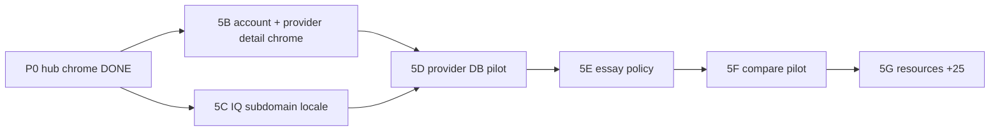

# Stage 5A — Next implementation plan (2026-05-21)

Post-audit staged rollout. **No work started** — planning only.

---

## Stage 5B — Private / account / auth UI cleanup

**Goal:** Close remaining safe UI gaps in account, signin, onboarding, subscription success, and provider **detail chrome** (not DB bodies).

| Item | Detail |
| --- | --- |
| DB writes | **No** |
| Auth logic | **No** changes unless regression found |
| Likely files | `app/providers/[id]/page.tsx`, `app/essays/[slug]/page.tsx`, `lib/seo/providerSeoQualityPolicy.ts` or reuse `providerDisplayLabels`, `accountProfileUiCopy.ts`, `authUiCopy.ts` |
| Production risk | **Low** |
| Verification | Logged-in spot-check `/es/account`; visible-text audit funnel paths; provider detail EN HTML |
| Rollback | Revert copy-only commit |

**Includes:**

- Provider detail: localize section headings, TOC, badges (reuse hub helpers), IQ CTA label
- Article shells: `On this page`, date line locale format
- Any remaining EN hub strings on private pages

---

## Stage 5C — IQ subdomain ES/FR architecture

**Goal:** Full user-facing IQ product in ES/FR with language switcher; English remains default on `iq.scholarshiptop.com/` without `/en`.

| Item | Detail |
| --- | --- |
| DB writes | **No** (v1 dictionary in repo) |
| OpenAI | **No** for v1 |
| Likely files | `middleware.ts`, `app/iq/layout.tsx`, `lib/i18n/iqUiCopy.ts`, `lib/cognitiveAssessmentQuestions.{locale}.ts`, `components/iq/AssessmentEngine.tsx`, `components/iq/UnlockedIqReport.tsx`, `IqProductFooter`, `app/iq/page.tsx` metadata |
| Production risk | **High** — separate host, assessment integrity |
| Verification | Manual full assessment ES/FR; smoke `iq.scholarshiptop.com`; scoring unit tests unchanged |
| Rollback | Disable locale middleware; revert to EN-only |

**Architecture choices (recommended):**

1. **Locale prefix on IQ host:** `iq.scholarshiptop.com/es/assessment` via middleware (mirror main site).
2. **Shared cookie** `ui_locale` with main domain where possible.
3. **Language switcher** in IQ header/footer (EN / ES / FR).
4. **Translated question bank** — duplicate structure per locale; same IDs/weights/answers.
5. **Result templates** per locale — no LLM output language drift in v1.

**Out of scope v1:** Translating IQ paywall Lemon flow.

---

## Stage 5D — Provider detail translation pilot

**Goal:** Published `content_translations` for `provider_profile` + localized routes.

| Item | Detail |
| --- | --- |
| DB writes | **Yes** — curated pilot providers only |
| Likely files | `app/[locale]/providers/[id]/page.tsx` (new), `localizedProviderDetailGate.ts`, seed script (internal), render from translation |
| Production risk | **Medium** — SEO/hreflang when published |
| Verification | `/es/providers/{pilot-slug}` 200; untranslated 404; EN canonical preserved |
| Rollback | Set translations `draft`; routes 404 |

**Prerequisite:** 5B chrome done; legal name policy documented.

---

## Stage 5E — Essay long-tail strategy

**Goal:** Decide and implement policy for `/essays/{cms-slug}`.

| Option | Behavior |
| --- | --- |
| A (recommended) | 404 under `/es|fr` until `essay_guide` translation published |
| B | Curated pilot (~10–25 essays) + `content_translations` |
| C | noindex EN-only long-tail (SEO team decision) |

| DB writes | Only if option B |
| Risk | Medium content quality |

---

## Stage 5F — Compare long-tail pilot

**Goal:** Optional `content_translations` for university/state compare pages.

| Item | Detail |
| --- | --- |
| DB writes | **Yes** if pilot |
| Policy | Either localized render or keep **EnglishZoneNotice** wrapper — **not** English body at `/es/compare/.../slug` without translation |
| Risk | Medium SEO (thin content) |

---

## Stage 5G — Resources batch +25

**Goal:** Continue resource_article pilot expansion after monitoring.

| Item | Detail |
| --- | --- |
| DB writes | **Yes** (existing pipeline) |
| Coupling | Low to IQ |
| Gate | Do not start until 5C architecture signed off if team capacity is limited |

---

## Sequencing recommendation

**Parallel track:** 5B + 5C  
**Serial after:** 5D → 5E → 5F → 5G

---

## Pause rule for DB batches

| Batch | Pause? |
| --- | --- |
| Provider profile bulk | **Yes** until 5B + 5D design |
| Essay CMS bulk | **Yes** until 5E policy |
| Compare bulk | **Yes** until 5F policy |
| Resource +25 | **Optional continue** with monitoring |

---

## Auth testing note (when implementing 5B)

Use existing test account only. Do not create/delete users in automation. Required checks:

- `/es/account` logged-in profile save
- `/es/signin` → `/es/onboarding` → return path
- Grant notification toggles ES copy
- Reset password flow with prior `/es` visit (sessionStorage locale)

No passwords or tokens in reports.
