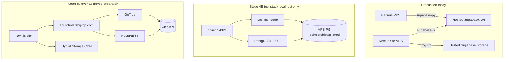

# Stage 4A — Supabase-compatible self-host design

**Дата:** 2026-06-24  
**Status:** Design + scaffold only  
**Prerequisite commits:** Stage 3B `a9894c8`  
**Production / parsers / Supabase:** **NOT switched**

## Verdict: **STAGE_4A_READY_FOR_IMPLEMENTATION**

Stage 4B (deploy test stack + run smoke) may proceed after operator fills VPS-only secrets. Production cutover remains blocked.

---

## 1. Executive summary

ScholarshipTop uses Supabase as a **platform**, not plain Postgres:

| Layer | Used | Self-host component |
|-------|------|---------------------|
| Auth (555 users, Google + email) | **Yes** | **GoTrue** |
| REST + RLS (`supabase-js` `.from()`, `.rpc()`) | **Yes** | **PostgREST** |
| Storage (~313 MB, 2 public buckets) | **Yes** | Hybrid CDN (Phase 1) or Storage API / MinIO (Phase 2) |
| Realtime / Edge Functions | **No** | Skip |
| `pg_net` HTTP triggers | **Yes** (parsers notify) | Not replicated on VPS — disable or replace in Stage 5+ |

**Minimum-change path:** self-host **GoTrue + PostgREST** on VPS against restored `scholarshiptop_prod`, keep **hosted Supabase Storage** read-only during transition, swap only `NEXT_PUBLIC_SUPABASE_URL` at cutover (same anon/service JWT keys if JWT secret matches).

Direct `DATABASE_URL` adapter alone **cannot** replace the site — ~117 runtime files use `supabase-js` with Auth + RLS.

---

## 2. Supabase Auth usage (inventory)

### Client stack

| Module | Pattern | Role |
|--------|---------|------|
| `utils/supabase/client.ts` | `@supabase/ssr` `createBrowserClient` | Browser auth + narrow DB reads |
| `utils/supabase/server.ts` | `createServerClient` + Next cookies | Server Components, API routes |
| `utils/supabase/middleware.ts` | `createServerClient` | Session refresh (`getUser`) |
| `utils/supabase/public.ts` | anon, no session | Public catalog reads |
| `lib/supabase/serviceRoleClient.ts` | service role | Admin auth + bypass RLS |
| `app/auth/callback/route.ts` | SSR + direct `@supabase/supabase-js` | OAuth / magic link / OTP callback |

Env consumed: `NEXT_PUBLIC_SUPABASE_URL`, `NEXT_PUBLIC_SUPABASE_ANON_KEY`, `SUPABASE_SERVICE_ROLE_KEY`.

### Production auth flows

| Flow | Mechanism | Self-host requirement |
|------|-----------|----------------------|
| **Google OAuth** | `signInWithOAuth` → `/auth/callback` | GoTrue + Google OAuth app (redirect URI for VPS API host) |
| **Password sign-in** | `signInWithPasswordClient` (default `/signin/password_signin`) | GoTrue password grant |
| **Magic link / OTP** | `signInWithOtp` on `/signin/email_signin` | GoTrue OTP + SMTP **or** keep Resend + `generateLink` |
| **Country signup (primary onboarding)** | `admin.createUser` + auto password login | GoTrue **admin API** (service role) |
| **Password reset** | Resend + `admin.generateLink({ type: 'recovery' })` | GoTrue admin `generateLink` |
| **Email verify (dual)** | GoTrue callback + custom `/auth/verify-email` + Resend | GoTrue + Resend unchanged |
| **Session refresh** | Middleware `getUser` on most routes | GoTrue JWT validation |
| **Sign out** | Client `signOut` + middleware stale-token cleanup | GoTrue revoke |
| **Billing / webhooks** | Service role updates `profiles`, `subscriptions` | PostgREST service role or direct SQL |

**Dead / low-traffic:** server-action `SignOut`, GitHub OAuth UI, onboarding password `signUp` branch (flag off), `resetPasswordForEmail` (never used).

### Middleware behavior

- Skips Supabase on `/` (CDN cache) and most `/signin/*`, `/auth/*`
- Runs `updateSession` on `/auth/reset_password`, `/signin/update_password`, and all other matched routes
- Cookie names: `sb-*-auth-token*` (detected by `utils/supabase/authCookie.ts`)
- Cookies live on **scholarshiptop.com** (Next.js domain), not Supabase host — API URL change is safe for cookies

### Auth migration risks

| Risk | Mitigation |
|------|------------|
| JWT secret mismatch | Copy Supabase project JWT secret to GoTrue + PostgREST; keep existing anon/service keys |
| OAuth redirect mismatch | Add VPS API host to Google Cloud Console **before** cutover test |
| Session invalidation at cutover | Maintenance window; users re-login once |
| `admin.generateLink` URL host | Ensure `API_EXTERNAL_URL` / site URL env matches production domain |
| 555 users + 730 sessions in DB | Restored `auth.*` schema — GoTrue reads existing rows |

---

## 3. Supabase DB API usage (inventory)

### Client tiers (~117 site files)

| Tier | Key | Tables (high traffic) | RLS |
|------|-----|----------------------|-----|
| **Browser anon** | anon + user JWT | `profiles` (select/upsert), `subscriptions` (select), `essay_results` (select) | Yes |
| **Server session** | anon + cookie JWT | `profiles`, `subscriptions`, `user_saved_scholarships`, `essay_*`, `scholarships`, APIs | Yes |
| **Public anon** | anon, no session | Scholarship catalog fallback, sitemaps | Public policies only |
| **Service role** | service_role | Webhooks, workers, analytics, Telegram, SEO queues, catalog preferred read | **Bypasses RLS** |

### Write paths on live site

| Surface | Tables | Ops |
|---------|--------|-----|
| Browser | `profiles` | upsert |
| Server session | `profiles`, `user_saved_scholarships`, `essay_results`, `essay_chats`, `questionnaire_responses` | insert/update/delete |
| Service role | `profiles`, `subscriptions`, `iq_report_orders`, analytics, workers | upsert/insert/update |

### RPC functions (site runtime)

| RPC | Auth context |
|-----|--------------|
| `get_comparison_data`, `get_state_comparison_data`, `get_compare_peer_institutions` | public/service |
| `get_scored_similar_scholarships`, `provider_profile_scholarship_aggregate` | public/service |
| `essays_hub_index_page`, `seo_generation_sitemap_paths`, `scholarship_active_counts_by_state_code` | public/service |
| `trial_reserve_quota`, `trial_release_quota` | server session (user JWT) |
| `upsert_visitor_attribution` | service role |
| `google_indexing_try_consume_quota*` | service role |
| `mark_content_topic_processing` | service role |

**PostgREST must expose** schemas `public`, `storage` (metadata), with roles `anon`, `authenticated`, `service_role` — already restored on VPS.

### RLS

- **49 policies** restored on VPS (Stage 3B PASS)
- Client-side trust model: browser never gets service role; server routes enforce `getUser()` before mutations
- Trial quotas rely on DB RPC under user JWT — PostgREST must forward `Authorization` header

### What breaks without PostgREST

All `.from()` and `.rpc()` calls — essentially the entire app data layer.

---

## 4. Storage usage (inventory)

| Bucket | Public | Objects | Writers | DB columns |
|--------|--------|---------|---------|------------|
| `essay-heroes` | yes | ~4,421 (~238 MB) | Essay generation (service role) | `essays.hero_image_url` (full URL) |
| `content-images` | yes | ~932 (~75 MB) | content-hub, backfill scripts | `content_posts.cover_image_url`, `cover_image_path` |

- **No signed URLs** — all public HTTP
- **No client SDK reads** — ``
- URLs stored as `https://qlqlvhgosxhuibzhfsnh.supabase.co/storage/v1/object/public/...`
- `cover_image_path` enables CDN base swap without parsing URLs

### Hybrid strategy (recommended Phase 1)

Keep **hosted Supabase Storage read-only** after Postgres cutover:

- Zero HTML/DB rewrite at cutover
- Essay/content pages keep loading images from Supabase CDN
- content-hub reuse flow (`fetch` essay hero → upload cover) still works if Supabase Storage reachable

Phase 2: bulk copy to R2/MinIO + URL rewrite or Cloudflare proxy.

Stage 4A test stack **does not deploy Storage API** — smoke verifies hybrid URLs separately.

---

## 5. Self-host architecture (target)



### Components

| Component | Image / version | Port (test) | Notes |
|-----------|-----------------|-------------|-------|
| GoTrue | `supabase/gotrue:v2.171.0` | 127.0.0.1:9999 | Auth API |
| PostgREST | `postgrest/postgrest:v12.2.8` | 127.0.0.1:3001 | REST + RLS |
| nginx gateway | `nginx:1.27-alpine` | 127.0.0.1:54321 | Maps `/auth/v1`, `/rest/v1` |
| PostgreSQL | PG 17 (host) | 127.0.0.1:5432 | Already restored |

### nginx production endpoint mapping (future)

| Path | Backend |
|------|---------|
| `https://api.scholarshiptop.com/auth/v1/*` | GoTrue |
| `https://api.scholarshiptop.com/rest/v1/*` | PostgREST |
| `https://api.scholarshiptop.com/storage/v1/*` | Hybrid → hosted Supabase **or** MinIO |

Example config: `ops/vps/nginx/includes/scholarshiptop-supabase-api-locations.example.conf`

### Env mapping (production cutover — NOT done in 4A)

| Current (hosted) | Future (VPS self-host) |
|------------------|------------------------|
| `NEXT_PUBLIC_SUPABASE_URL=https://xxx.supabase.co` | `https://api.scholarshiptop.com` (or internal) |
| `NEXT_PUBLIC_SUPABASE_ANON_KEY` | **Same JWT** if `JWT_SECRET` copied |
| `SUPABASE_SERVICE_ROLE_KEY` | **Same JWT** if secret matches |
| `SUPABASE_URL` (parsers) | Same API base as site |
| `DB_PROVIDER=supabase` | `supabase` until cutover; optional flag for direct SQL parsers |

Template: `ops/env/supabase-api.env.example`  
Docker scaffold: `ops/vps/docker-compose.supabase-api.example.yml`

---

## 6. Compatibility matrix (`supabase-js`)

| Feature | Works with GoTrue + PostgREST | Notes |
|---------|------------------------------|-------|
| `auth.signInWithOAuth` | **Yes** | Google redirect URIs must include API host |
| `auth.signInWithPassword` | **Yes** | |
| `auth.signInWithOtp` | **Yes** | Needs GoTrue SMTP or keep Resend+generateLink |
| `auth.getUser` / `getSession` | **Yes** | JWT secret must match |
| `auth.exchangeCodeForSession` | **Yes** | PKCE callback |
| `auth.admin.createUser` | **Yes** | Service role → GoTrue admin |
| `auth.admin.generateLink` | **Yes** | Recovery / magiclink |
| `.from().select/insert/update/delete` | **Yes** | Via PostgREST + RLS |
| `.rpc()` | **Yes** | Functions in `public` schema |
| `storage.from().upload` | **No** (Phase 1) | Needs Storage API or stay on hosted |
| `storage.from().getPublicUrl` | **Partial** | URL builder works; origin must serve files |
| Realtime | **N/A** | Not used |
| Edge Functions | **N/A** | Not used |
| `supabase_functions.http_request` triggers | **No** | Supabase-specific; skipped on restore |
| `pg_net` triggers | **No** | Extension not on VPS |

### Adapter needs

| Area | Adapter required? |
|------|-------------------|
| Auth | **No** — GoTrue compatible |
| DB reads/writes | **No** — PostgREST compatible |
| Storage uploads (workers) | **Yes, Phase 2** — or keep hosted Storage |
| Storage display (HTML) | **No, Phase 1** — hybrid CDN |
| Parsers (Python supabase-py) | **No** — same API URL swap |
| Direct `DATABASE_URL` for parsers | **Optional** Stage 5 — separate from site API |

### Env flags

| Flag | Purpose | Stage |
|------|---------|-------|
| `DB_PROVIDER=supabase` | Current default | Now |
| `DB_PROVIDER=vps_postgres` | Direct SQL paths (parsers/scripts) | Stage 5+ |
| `SELFHOST_API_BASE_URL` | Stage 4B smoke test client | 4B only |
| `STORAGE_PUBLIC_BASE_URL` | Future CDN rewrite (not implemented) | Phase 2 |

No code changes required for Stage 4B smoke if test client points at `SELFHOST_API_BASE_URL`.

---

## 7. Security checklist

| Topic | Requirement |
|-------|-------------|
| **JWT secret** | Copy from Supabase Dashboard → store VPS-only; GoTrue + PostgREST must share it |
| **Anon / service keys** | Existing JWTs remain valid if secret unchanged; do not regenerate without plan |
| **RLS** | 49 policies on VPS — PostgREST enforces via `anon` / `authenticated` roles |
| **Service role** | VPS-only; never expose to browser; same as today |
| **OAuth** | Google client: add `https://api-test.scholarshiptop.com/auth/v1/callback` for 4B |
| **Magic link / recovery** | Resend + `generateLink` — links must use production `SITE_URL` |
| **Cookies** | `@supabase/ssr` on scholarshiptop.com — **Secure, HttpOnly, SameSite** via Next.js |
| **HTTPS** | Production API behind Cloudflare Full (strict) — test stack localhost only |
| **Network** | GoTrue/PostgREST bind **127.0.0.1** until nginx TLS ready |
| **Secrets in git** | Only `.example` templates — see `.gitignore` |

---

## 8. Architecture options

### Option A — GoTrue + PostgREST + hybrid Storage **(RECOMMENDED)**

| | |
|--|--|
| **Changes** | Deploy GoTrue + PostgREST on VPS; nginx API gateway; swap `NEXT_PUBLIC_SUPABASE_URL` at cutover; keep Storage on Supabase CDN Phase 1 |
| **Risk** | **Medium** — OAuth redirects, JWT secret sync, one-time user re-login |
| **Rollback** | Revert env to hosted Supabase URL (< 5 min); VPS PG untouched |
| **Complexity** | **M** — ~2–3 days infra + 4B smoke + staged cutover window |
| **Code churn** | **Minimal** (~0 app changes for Phase 1) |

### Option B — Auth.js + direct DB adapter

| | |
|--|--|
| **Changes** | Replace `@supabase/ssr` with Auth.js; replace all `supabase-js` with `pg`/Drizzle; reimplement RLS in app layer |
| **Risk** | **High** — auth regression, RLS gaps, 667 files touched |
| **Rollback** | Hard — requires redeploy previous app version |
| **Complexity** | **XL** — months |
| **Code churn** | **Massive** |

### Option C — Keep Supabase Auth + move parsers only

| | |
|--|--|
| **Changes** | Parsers use `DATABASE_URL` direct to VPS PG; site stays on hosted Supabase API |
| **Risk** | **Low** for site; **Medium** for dual-write on `scholarships`, `google_indexing_queue` |
| **Rollback** | Point parsers back to Supabase API |
| **Complexity** | **S** for parsers only |
| **Code churn** | Parsers + env only |

**Not sufficient for full platform migration** — site still depends on hosted Supabase. Valid as **Stage 5 parser sub-step** before site cutover.

### Recommendation

**Option A** with phased Storage:

1. **Stage 4B:** Deploy test stack (localhost), run `stage4a-selfhost-smoke-plan.sh`
2. **Stage 5:** Parser direct SQL (optional, no dual-write)
3. **Stage 6:** Maintenance window — swap API URL, hybrid Storage, monitor 24h

---

## 9. Stage 4B smoke plan (no production switch)

Script: `scripts/vps-migration/stage4a-selfhost-smoke-plan.sh`

```bash
# 1. Print checklist
bash scripts/vps-migration/stage4a-selfhost-smoke-plan.sh --plan

# 2. DB-only (restored VPS PG — safe now)
DATABASE_URL='postgresql://...@127.0.0.1:5432/scholarshiptop_prod' \
  bash scripts/vps-migration/stage4a-selfhost-smoke-plan.sh --db-only

# 3. Full API smoke (after 4B stack up, localhost only)
SELFHOST_API_BASE_URL=http://127.0.0.1:54321 \
SUPABASE_ANON_KEY='...' \
  bash scripts/vps-migration/stage4a-selfhost-smoke-plan.sh --internal
```

| # | Check | Pass criteria |
|---|-------|---------------|
| 1 | GoTrue health | HTTP 200 |
| 2 | PostgREST `/rest/v1/` | Reachable |
| 3 | Auth password grant (test user) | JWT + `/auth/v1/user` |
| 4 | Scholarship read (anon) | 200 + JSON |
| 5 | Profile read (user JWT) | Own row only |
| 6 | RPC `get_comparison_data` | 200 |
| 7 | RLS negative (profiles anon) | Empty / filtered |
| 8 | Storage hybrid URL | HEAD 200 on hosted CDN sample |
| 9 | Production env unchanged | `site.env` still hosted URL |
| 10 | Parsers unchanged | Still `SUPABASE_URL` hosted |

---

## 10. Scaffold files (safe, no secrets)

| File | Purpose |
|------|---------|
| `ops/vps/docker-compose.supabase-api.example.yml` | GoTrue + PostgREST + nginx test gateway |
| `ops/env/supabase-api.env.example` | Env template (JWT, DB, OAuth placeholders) |
| `ops/vps/nginx/includes/scholarshiptop-supabase-api-locations.example.conf` | `/auth/v1`, `/rest/v1` proxy |
| `scripts/vps-migration/stage4a-selfhost-smoke-plan.sh` | Smoke plan + runners |

**Not included (Stage 4B+):** Storage API, MinIO, production nginx cutover, `site.env` changes.

---

## 11. Known gaps / warnings

| Gap | Impact | Stage |
|-----|--------|-------|
| `pg_net` not on VPS | Scholarship notify trigger inactive on VPS DB | 5+ |
| `supabase_functions` triggers | Skipped on restore | 5+ |
| Storage API not in 4A stack | Upload workers need hosted Storage or Phase 2 | 4B–6 |
| `@supabase/ssr` 0.1.0 | Old version — test auth cookie refresh carefully | 4B |
| Session count 730 at export | Stale sessions in DB — acceptable | — |
| Stripe legacy `utils/supabase/admin.ts` | Still service role — works via PostgREST | — |

---

## 12. Rollback (any stage)

| Action | Effect |
|--------|--------|
| Stop test docker stack | Zero production impact |
| Revert `NEXT_PUBLIC_SUPABASE_URL` | Site returns to hosted Supabase |
| Drop VPS test DB | `scholarshiptop_prod` preserved separately |
| Hosted Supabase | Never modified in Stages 1–4A |

---

## 13. Final verdict

| Criterion | Result |
|-----------|--------|
| Auth inventory | **Complete** |
| DB API inventory | **Complete** |
| Storage inventory | **Complete** |
| Architecture options | **Documented** — Option A recommended |
| Smoke plan | **Scripted** — no production switch |
| Safe scaffold | **Added** (examples only) |
| Production / parsers / Supabase | **Unchanged** |

### **STAGE_4A_READY_FOR_IMPLEMENTATION**

**PASS_WITH_WARNINGS:** Storage hybrid required Phase 1; `pg_net` / Edge triggers not replicated.

**Do not start Stage 4B deployment or production cutover without separate approval.**

---

## Appendix A — Key source files

| Area | Paths |
|------|-------|
| Browser client | `utils/supabase/client.ts` |
| Server client | `utils/supabase/server.ts` |
| Middleware | `utils/supabase/middleware.ts`, `middleware.ts` |
| Service role | `lib/supabase/serviceRoleClient.ts` |
| Auth callback | `app/auth/callback/route.ts` |
| Password reset | `lib/email/sendPasswordResetEmail.ts` |
| Scholarship reads | `lib/scholarships/supabase.ts` |
| Storage upload | `lib/essays/essayHeroIngest.ts`, `services/content-hub/src/lib/supabase.ts` |
| Stage 3 restore | `ops/vps/scripts/restore-postgres-*.sh` |
| Inventory | `reports/vps-migration/12-supabase-to-vps-db-inventory-2026-06-24.md` |
